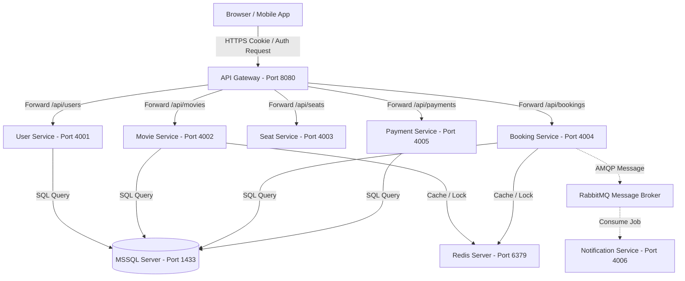

# BÁO CÁO PHÂN TÍCH THIẾT KẾ KỸ THUẬT: PHƯƠNG ÁN TRIỂN KHAI HỆ THỐNG

**Hệ thống:** XemPhim - Nền tảng đặt vé xem phim trực tuyến (Microservices Architecture)  
**Vai trò:** Business Analyst / Solution Architect  
**Trạng thái:** Tài liệu Đặc tả Triển khai - Đã Phê Duyệt  

---

## 1. Tổng Quan Mô Hình Triển Khai (Deployment Architecture)

Hệ thống được thiết kế và triển khai theo mô hình **Distributed Microservices (Kiến trúc phân tán nhiều dịch vụ)**. Mỗi nghiệp vụ cốt lõi được cô lập thành một tiến trình chạy riêng biệt nhằm tối ưu hóa tài nguyên và nâng cao tính sẵn sàng của hệ thống.



---

## 2. Đặc Tả Các Thành Phần Trong Kiến Trúc Triển Khai

### 2.1 Tách biệt Frontend & Backend (Decoupled Architecture)
*   **Frontend (React/Next.js):** Chạy độc lập trên cổng `3000`. Giao tiếp với backend thông qua giao thức HTTP/REST API duy nhất tại cổng API Gateway (`8080`). Không có sự phụ thuộc mã nguồn (no code coupling) giữa giao diện người dùng và logic xử lý nghiệp vụ phía sau.
*   **Backend (Microservices):** Gồm 6 dịch vụ Node.js chạy độc lập trên các cổng mạng riêng biệt:
    *   `api-gateway` (hoặc `gateway`): Port `8080`
    *   `user-service`: Port `4001`
    *   `movie-service`: Port `4002`
    *   `seat-service`: Port `4003`
    *   `booking-service`: Port `4004`
    *   `payment-service`: Port `4005`
    *   `notification-service`: Port `4006`

### 2.2 Quản Lý Cấu Hình Tập Trung Bằng Môi Trường (`.env`)
Để tuân thủ nguyên tắc **12-Factor App** về cấu hình hệ thống, tất cả các tham số cấu hình nhạy cảm (như thông tin xác thực CSDL, khóa bảo mật JWT, API key của ZaloPay, địa chỉ cổng kết nối) đều được tách biệt hoàn toàn khỏi mã nguồn và quản lý qua các file `.env` riêng biệt cho từng service hoặc file `.env` chung ở thư mục gốc của dự án.
*   **Ví dụ cấu hình mẫu:**
    ```env
    PORT=4004
    DB_HOST=localhost
    DB_PORT=1433
    DB_USER=sa
    DB_PASS=your_password
    REDIS_URL=redis://localhost:6379
    CLOUDAMQP_URL=amqps://...
    PAYMENT_SERVICE_URL=http://localhost:4005
    MOVIE_SERVICE_URL=http://localhost:4002
    ```

### 2.3 Cơ Sở Dữ Liệu Quan Hệ (RDBMS MSSQL)
*   Toàn bộ dữ liệu trạng thái nghiệp vụ (Booking, User, Showtime, Movie, Seat) được lưu trữ tập trung tại hệ quản trị cơ sở dữ liệu **Microsoft SQL Server (MSSQL)**.
*   Các dịch vụ tương tác với MSSQL thông qua Sequelize ORM, hỗ trợ xử lý Transaction ở mức cô lập cao (`t.LOCK.UPDATE`) nhằm đảm bảo tính toàn vẹn dữ liệu trong các luồng nghiệp vụ mua vé.
*   **Ví dụ minh họa luồng xử lý Transaction với Lock dòng (Row Lock):**
    Khi tiến trình giữ ghế thực hiện kiểm tra trạng thái vé cũ, hệ thống mở một Sequelize Transaction và áp dụng khóa `t.LOCK.UPDATE` (tương đương với mệnh đề `WITH (UPDLOCK, ROWLOCK)` trong MSSQL) để khóa tất cả các dòng dữ liệu đang đọc, ngăn chặn các luồng ghi khác can thiệp cho đến khi transaction kết thúc (Commit/Rollback).

    ```javascript
    const t = await sequelize.transaction();
    try {
      const conflict = await Booking.findAll({
        where: { showtime_id, seat_id },
        transaction: t,
        lock: t.LOCK.UPDATE // Row-level lock (UPDLOCK) trong MSSQL
      });
      
      // Ghi nhận đặt vé và commit transaction
      await t.commit();
    } catch (err) {
      await t.rollback();
    }
    ```


### 2.4 Tích Hợp Cổng Thanh Toán ZaloPay (ZaloPay Sandbox Environment)
*   Hệ thống tích hợp cổng thanh toán thử nghiệm **ZaloPay Sandbox** để giả lập các giao dịch thanh toán vé phim ngoài đời thực.
*   Cấu hình thông số tích hợp:
    *   `app_id`: `2554` (Ứng dụng thử nghiệm mặc định của ZaloPay)
    *   `key1`: Dùng để tạo mã ký chữ ký (MAC) gửi yêu cầu thanh toán/hoàn tiền.
    *   `key2`: Dùng để xác thực tính toàn vẹn của chữ ký MAC khi nhận Callback/Webhook từ ZaloPay.
    *   `endpoint`: `https://sb-openapi.zalopay.vn` (Môi trường Sandbox phục vụ kiểm thử)

### 2.5 Bộ Nhớ Đệm & Khóa Phân Tán (Redis Server)
Hệ thống sử dụng **Redis** cho hai mục đích chiến lược về hiệu năng và nghiệp vụ:

#### A. Khóa phân tán (Distributed Lock)
*   **Mục đích:** Đảm bảo duy nhất một luồng nghiệp vụ được thao tác trên cặp thông tin `{Lịch chiếu, Ghế}` tại một thời điểm cực ngắn ở mức micro-second trước khi cập nhật trạng thái vào cơ sở dữ liệu chính.
*   **Cơ chế mã nguồn:** Sử dụng lệnh `SET key value NX PX ttl` (chỉ set nếu chưa tồn tại key, kèm theo TTL thời gian sống tự hủy để tránh dead-lock nếu luồng xử lý bị crash). Khi giao dịch hoàn tất (thành công hoặc bị hủy/lỗi), hệ thống gọi lệnh `DEL key` để giải phóng tài nguyên.
*   **Mã nguồn minh họa (`services/booking-service/services/bookingService.js`):**
    ```javascript
    // Giữ ghế bằng cách ghi lock vào Redis với tùy chọn NX (chỉ tạo khi chưa có) và PX (TTL)
    const isLocked = await redis.set(`lock:showtime:${showtimeId}:seat:${seatId}`, 'locked', 'NX', 'PX', 120000);
    
    // Giải phóng khóa sau khi thanh toán hoặc hủy
    await redis.del(`lock:showtime:${showtimeId}:seat:${seatId}`);
    ```

#### B. Bộ nhớ đệm dữ liệu (Data Caching)
*   **Mục đích:** Lưu trữ tạm thời kết quả truy vấn các thông tin phim/suất chiếu để tối ưu hiệu năng.
*   **Mã nguồn minh họa (Ví dụ Caching & Invalidation):**
    ```javascript
    // Đọc từ Redis Cache trước
    const cached = await redis.get(`movies:detail:${id}`);
    if (cached) return JSON.parse(cached); // Cache Hit

    // Cache Miss: Đọc từ MSSQL DB và ghi đệm vào Redis với TTL 1 giờ (EX 3600)
    const movie = await Movie.findByPk(id);
    await redis.set(`movies:detail:${id}`, JSON.stringify(movie), 'EX', 3600);
    
    // Xóa Cache (Invalidate) khi cập nhật dữ liệu phim
    await redis.del(`movies:detail:${id}`);
    ```


### 2.6 Hàng Đợi Tin Nhắn Bất Đồng Bộ (RabbitMQ Message Broker)
*   **Mục đích:** Hủy liên kết trực tiếp (Decoupling) giữa tiến trình đặt vé chính và tiến trình phụ (gửi email thông báo vé thành công cho người dùng).
*   **Luồng hoạt động:**
    1.  Khi thanh toán vé được xác nhận thành công, `booking-service` đẩy một thông điệp (Message payload chứa thông tin vé, email nhận) vào hàng đợi `ticket.notifications` trong RabbitMQ.
    2.  `notification-service` chạy ngầm sẽ tiêu thụ tin nhắn này (Consume) và tiến hành kết nối đến SMTP Server để gửi mail cho khách hàng.
*   **Cơ chế dự phòng (HTTP Fallback):** Trong trường hợp RabbitMQ Broker gặp sự cố ngắt kết nối, hệ thống tự động chuyển hướng gọi trực tiếp thông qua REST API HTTP đến `notification-service` để tránh làm mất mát thông báo vé của khách hàng.

---

## 3. Các Luồng Xử Lý Đặc Thù Trong Môi Trường Phát Triển & Vận Hành

### 3.1 Cơ Chế Stateless Auth & Bảo Mật Cookie HttpOnly Qua API Gateway
Để giải quyết bài toán chia sẻ phiên đăng nhập giữa các microservices mà vẫn bảo mật tối đa trước các lỗ hổng bảo mật phía client (XSS):
*   **HttpOnly Cookie:** Khi đăng nhập thành công, token JWT (`access_token`) được lưu trực tiếp vào trình duyệt dưới dạng Cookie HttpOnly. JavaScript chạy trên frontend hoàn toàn không thể truy cập được Cookie này.
*   **Gateway Interceptor:** API Gateway đóng vai trò chốt chặn. Mọi request gửi từ Client lên Gateway sẽ đi qua một middleware xác thực. Middleware này giải mã Cookie, lấy thông tin user rồi gắn vào Request Headers chuyển tiếp xuống dưới:
    ```javascript
    req.headers['x-user-id'] = String(decoded.id);
    req.headers['x-user-role'] = String(decoded.role);
    ```
    Nhờ vậy, các microservice nội bộ hoàn toàn stateless và chỉ cần đọc thông tin định danh trực tiếp từ header để xử lý phân quyền.

---

### 3.2 Nhận Webhook / Callback ZaloPay Ở Môi Trường Local Qua Ngrok Tunnel
*   **Vấn đề kỹ thuật:** Cổng thanh toán ZaloPay (nằm trên Internet) cần gửi một request HTTP POST (Callback/Webhook) về địa chỉ backend để xác nhận giao dịch đã được người dùng quét mã thanh toán thành công. Tuy nhiên, trong môi trường phát triển (Local Development), backend đang chạy trên địa chỉ mạng nội bộ (ví dụ: `http://localhost:8080`), ZaloPay không thể truy cập trực tiếp được.
*   **Giải pháp xử lý:** Sử dụng công cụ **ngrok** để thiết lập một đường hầm bảo mật (Secure Tunnel) ánh xạ cổng `8080` của máy local thành một URL công khai trên Internet (ví dụ: `https://unsentiently-fattenable-daria.ngrok-free.dev`).
*   **Cấu hình thực tế:** URL public này được cấu hình trực tiếp vào tham số `ZALOPAY_CALLBACK_URL` trong file `.env` của backend, cho phép ZaloPay gửi tín hiệu callback thành công đến local machine một cách thông suốt.

---

## 4. Công Cụ Hỗ Trợ Phát Triển Hệ Thống (Development Tools)

Quá trình phát triển và vận hành thử nghiệm tại local sử dụng các công cụ tối giản nhưng hiệu quả cao:

1.  **npm (Node Package Manager):** Quản lý toàn bộ thư viện dependencies cho từng service độc lập. Định nghĩa các script khởi chạy toàn bộ dịch vụ cùng lúc để tối ưu thao tác cho lập trình viên (ví dụ: `npm run dev-all` khởi chạy tất cả các microservices).
2.  **nodemon:** Công cụ giám sát sự thay đổi của mã nguồn trong quá trình viết code. Khi nhà phát triển thay đổi bất kỳ dòng mã nào, nodemon sẽ tự động khởi động lại (Hot Reload) dịch vụ tương ứng ngay lập tức mà không cần thao tác tắt đi bật lại thủ công.
3.  **ngrok:** Công cụ tạo đường hầm HTTP Tunnel như đã trình bày ở phần 3.2, đóng vai trò sống còn trong việc kiểm thử luồng tích hợp cổng thanh toán bên thứ ba (ZaloPay) trên máy trạm cá nhân.

---

## 5. Đánh Giá & Lưu Ý Vận Hành (BA Recommendations)

*   **⚠️ Lưu ý về ngrok:** Do tài khoản ngrok miễn phí sẽ thay đổi domain public ngẫu nhiên sau mỗi lần khởi động lại lệnh, đội ngũ phát triển phải luôn kiểm tra và cập nhật thủ công tham số `ZALOPAY_CALLBACK_URL` trong file cấu hình `.env` tương ứng để tránh lỗi mất tín hiệu callback xác nhận thanh toán.
*   **🛡️ Khuyến nghị bảo mật:** Khi chuyển dịch hệ thống từ môi trường phát triển local lên môi trường Production (Staging/Live):
    *   Bắt buộc loại bỏ `ngrok` và thay thế bằng domain thật cấu hình SSL/TLS (HTTPS).
    *   Các thông tin nhạy cảm trong file `.env` (Database Password, ZaloPay Secret Key) phải được mã hóa hoặc đưa vào các hệ thống quản lý cấu hình bảo mật chuyên biệt (ví dụ: HashiCorp Vault, AWS Secrets Manager).
