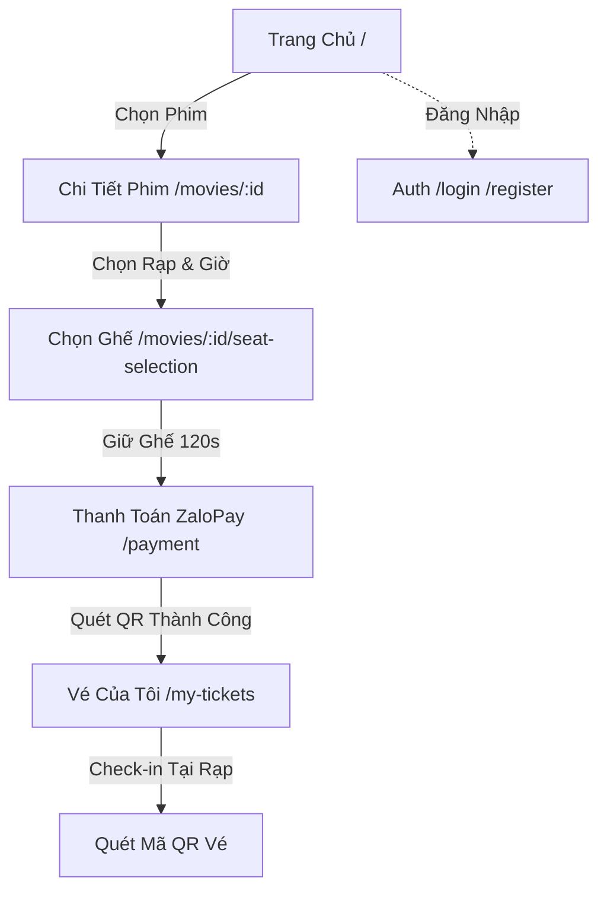

# 🎨 HƯỚNG DẪN THIẾT KẾ GIAO DIỆN (UI/UX REDESIGN GUIDE)
## HỆ THỐNG ĐẶT VÉ XEM PHIM MICROSERVICES (XEMPHIM)

> **Mục tiêu**: Cung cấp tài liệu quy chuẩn thiết kế giao diện toàn diện cho các công cụ thiết kế (Google Stitch, Figma, v0) và lập trình Frontend ReactJS, đảm bảo **100% tương thích với hệ thống Backend Microservices hiện tại mà không làm gãy vỡ API hay luồng dữ liệu**.

---

## 📑 MỤC LỤC
1. [Triết lý Thiết kế & Design System (Tokens)](#1-triết-lý-thiết-kế--design-system-tokens)
2. [Sơ đồ Luồng người dùng (User Flow & Sitemap)](#2-sơ-đồ-luồng-người-dùng-user-flow--sitemap)
3. [Chi tiết từng Màn hình & Khớp nối API Backend](#3-chi-tiết-từng-màn-hình--khớp-nối-api-backend)
   - [Màn hình 1: Trang Chủ (Home Page)](#màn-hình-1-trang-chủ-home-page)
   - [Màn hình 2: Chi tiết Phim & Lịch Chiếu (Movie Detail)](#màn-hình-2-chi-tiết-phim--lịch-chiếu-movie-detail)
   - [Màn hình 3: Sơ đồ Ghế & Giữ ghế Thời gian thực (Seat Selection)](#màn-hình-3-sơ-đồ-ghế--giữ-ghế-thời-gian-thực-seat-selection)
   - [Màn hình 4: Thanh toán & Mã QR ZaloPay (Payment & Dynamic QR)](#màn-hình-4-thanh-toán--mã-qr-zalopay-payment--dynamic-qr)
   - [Màn hình 5: Vé của tôi & Check-in QR (My Tickets)](#màn-hình-5-vé-của-tôi--check-in-qr-my-tickets)
   - [Màn hình 6: Xác thực Tài khoản (Auth Modal / Pages)](#màn-hình-6-xác-thực-tài-khoản-auth-modal--pages)
4. [Bộ Prompt Mẫu chuẩn bị sẵn cho Google Stitch](#4-bộ-prompt-mẫu-chuẩn-bị-sẵn-cho-google-stitch)
5. [Các bẫy kỹ thuật cần tránh để không vỡ Backend](#5-các-bẫy-kỹ-thuật-cần-tránh-để-không-vỡ-backend)

---

## 1. Triết lý Thiết kế & Design System: VÀNG ĐEN LUXURY (ROYAL BLACK & GOLD)

Hệ thống lấy cảm hứng từ phong cách **Ultra-Luxury Cinema Club (Rạp Chiếu Phim Hoàng Gia)**: 
- Nền đen huyền bí sâu thẳm (**Obsidian & Onyx Black**).
- Điểm nhấn chủ đạo màu vàng kim ánh kim loại (**Imperial Metallic Gold & Champagne Gold**).
- Hiệu ứng phản chiếu kim loại sáng bóng, viền ánh vàng sang trọng (Golden Hairline Glow), tạo cảm giác phòng chiếu VIP thượng hạng chuẩn 5 sao.

### 1.1. Bảng màu chuẩn Vàng Đen Luxury (Color Palette)
| Nhóm màu | Tên mã | Hex Code | Ứng dụng thực tế |
|---|---|---|---|
| **Nền siêu tối (Dark)** | Obsidian Black | `#08090C` | Nền toàn trang, đen sâu tĩnh lặng chuẩn rạp chiếu |
| **Bề mặt thẻ (Surface)** | Onyx Surface | `#12161F` | Nền các Card phim, Drawer, Popup kính mờ |
| **Viền kim loại (Borders)** | Gold Hairline | `rgba(212, 175, 55, 0.25)` | Viền mảnh phản quang ánh vàng sang trọng |
| **Vàng chủ đạo (Primary)** | Metallic Gold | `#D4AF37` | **Màu thương hiệu chính**: Nút bấm CTA, Icon, Viền Active |
| **Vàng sáng (Highlight)** | Champagne Gold | `#F5E6AB` | Màu chữ tiêu đề VIP, hiệu ứng hover lấp lánh |
| **Vàng đậm (Deep Gold)** | Antique Bronze | `#AA771C` | Đổ bóng Gradient chiều sâu kim loại |
| **Ghế VIP (Crown VIP)** | Imperial Gold | `#F3C644` | Ghế VIP hoàng gia (đính kèm biểu tượng vương miện 👑) |
| **Ghế Đang chọn** | Bright Gold | `#FFD700` | Ghế đang click chọn (phát sáng viền `0 0 15px #FFD700`) |
| **Ghế Trống (Available)** | Satin Silver | `#D1D5DB` | Màu bạc mờ tinh tế trên nền tối |
| **Ghế Đã bán (Occupied)** | Muted Charcoal | `#2A2E39` | Màu xám tro chìm hẳn vào nền |
| **Ghế Đang giữ (Locked)** | Amber Glow | `#FF8C00` | Màu hổ phách nhấp nháy đếm ngược 120s |
| **Văn bản chính (Text 1)** | Pure White | `#FFFFFF` | Tiêu đề phim, thông tin giờ chiếu |
| **Văn bản phụ (Text 2)** | Silver Smoke | `#9CA3AF` | Thể loại, đạo diễn, phụ đề |

### 1.2. Typography (Phông chữ Đẳng cấp)
- **Font Family**: Google Fonts `Cinzel` hoặc `Playfair Display` (cho tiêu đề phim/logo mang hơi hướng điện ảnh cổ điển), kết hợp `Outfit` / `Inter` (cho các nút bấm, giờ chiếu, số ghế để tối ưu độ đọc).
- **Display Hero**: 38px – 52px, `font-weight: 800`, chữ in hoa dập nổi với dải màu Gradient:
  `background: linear-gradient(135deg, #FFFFFF 20%, #D4AF37 70%, #AA771C 100%); -webkit-background-clip: text;`
- **Heading Title**: 24px – 28px, `font-weight: 700`, màu `#F5E6AB`.
- **Button CTA Text**: 14px – 16px, `font-weight: 700`, màu đen `#08090C` trên nền Vàng Gold.

### 1.3. Hiệu ứng thẩm mỹ Vàng Kim (Visual Luxury Effects)
- **Gold Metallic Gradient**:
  `background: linear-gradient(135deg, #D4AF37 0%, #F5E6AB 50%, #B8860B 100%);`
  Áp dụng cho các nút bấm chính (*"ĐẶT VÉ NGAY"*, *"THANH TOÁN"*).
- **Curved Golden Cinema Screen**:
  Màn chiếu rạp cong có dải ánh sáng vàng champagne tỏa xuống:
  `box-shadow: 0px 12px 45px -5px rgba(212, 175, 55, 0.45); border-top: 3px solid #D4AF37;`
- **Glassmorphism viền vàng**:
  `background: rgba(18, 22, 31, 0.85); backdrop-filter: blur(16px); border: 1px solid rgba(212, 175, 55, 0.2);`

---

## 2. Sơ đồ Luồng người dùng (User Flow & Sitemap)



---

## 3. Chi tiết từng Màn hình & Khớp nối API Backend

---

### Màn hình 1: Trang Chủ (Home Page)

#### 🖼️ Bố cục Wireframe:
```text
┌────────────────────────────────────────────────────────────────────────┐
│ [LOGO]  Phim Đang Chiếu   Phim Sắp Chiếu   Rạp Chiếu    [Search] [User] │
├────────────────────────────────────────────────────────────────────────┤
│ [ HERO BANNER SLIDER: Phim Bom Tấn Nổi Bật                           ] │
│   "AVATAR 3: DÒNG CHẢY CỦA NƯỚC"                                      │
│   ⭐ 8.9 | Hành động, Viễn tưởng | 192 phút                           │
│   [ 🎟️ Đặt Vé Ngay ]  [ ▶ Xem Trailer ]                               │
├────────────────────────────────────────────────────────────────────────┤
│ (Tab: Đang Chiếu)   (Tab: Sắp Chiếu)                    [Lọc Thể Loại] │
│ ┌──────────┐  ┌──────────┐  ┌──────────┐  ┌──────────┐  ┌──────────┐   │
│ │ [Poster] │  │ [Poster] │  │ [Poster] │  │ [Poster] │  │ [Poster] │   │
│ │ Phim 1   │  │ Phim 2   │  │ Phim 3   │  │ Phim 4   │  │ Phim 5   │   │
│ │ ⭐ 8.5   │  │ ⭐ 9.1   │  │ ⭐ 7.8   │  │ ⭐ 8.0   │  │ ⭐ 8.9   │   │
│ │ [Đặt vé] │  │ [Đặt vé] │  │ [Đặt vé] │  │ [Đặt vé] │  │ [Đặt vé] │   │
│ └──────────┘  └──────────┘  └──────────┘  └──────────┘  └──────────┘   │
└────────────────────────────────────────────────────────────────────────┘
```

#### 🔌 Khớp nối Backend:
- **Endpoint**: `GET http://localhost:8080/api/movies`
- **Response Schema từ Movie Service**:
  ```json
  {
    "movies": [
      {
        "id": 1,
        "title": "Kẻ Trộm Mặt Trăng 4",
        "description": "Gru và các Minions trở lại...",
        "poster_url": "https://...",
        "backdrop_url": "https://...",
        "trailer_url": "https://youtube.com/...",
        "duration_minutes": 94,
        "rating": 8.5,
        "director": "Chris Renaud",
        "status": "now_showing" // hoặc "coming_soon"
      }
    ]
  }
  ```

---

### Màn hình 2: Chi tiết Phim & Lịch Chiếu (Movie Detail)

#### 🖼️ Bố cục Wireframe:
```text
┌────────────────────────────────────────────────────────────────────────┐
│ < Quay lại                                                             │
│ [ BACKDROP LỚN MỜ ẢO PHÍA SAU ]                                       │
│ ┌────────┐  TÊN BỘ PHIM (2026)                                         │
│ │        │  ⭐ 8.9/10 (1.2k đánh giá) | 120 phút | 2D/IMAX             │
│ │ POSTER │  Đạo diễn: ... | Diễn viên: ...                            │
│ │        │  Nội dung tóm tắt phim...                                  │
│ └────────┘  [ ▶ Xem Trailer ]                                          │
├────────────────────────────────────────────────────────────────────────┤
│ 📅 BỘ CHỌN NGÀY CHIẾU:                                                 │
│ [ Hôm Nay (10/09) ]  [ T6 (11/09) ]  [ T7 (12/09) ]  [ CN (13/09) ]    │
├────────────────────────────────────────────────────────────────────────┤
│ 🏢 CỤM RẠP: CGV Vincom Bà Triệu                                       │
│    Phòng 01 (2D Digital)                                               │
│    [ 09:30 - 90k ]   [ 13:15 - 90k ]   [ 18:45 - 110k ]   [ 21:30 ]    │
│ 🏢 CỤM RẠP: BHD Star Cineplex                                         │
│    Phòng 03 (3D IMAX)                                                 │
│    [ 10:00 - 130k ]  [ 14:00 - 130k ]  [ 19:30 - 150k ]                │
└────────────────────────────────────────────────────────────────────────┘
```

#### 🔌 Khớp nối Backend:
- **Endpoint 1 (Chi tiết phim)**: `GET /api/movies/:id`
- **Endpoint 2 (Suất chiếu)**: `GET /api/movies/:id/showtimes`
- **Response Schema từ Movie Service**:
  ```json
  [
    {
      "id": 101,
      "movie_id": 1,
      "start_time": "2026-09-10T18:45:00.000Z",
      "end_time": "2026-09-10T20:45:00.000Z",
      "base_price": 90000,
      "CinemaHall": {
        "id": 5,
        "name": "Phòng Chiếu 01 (2D)",
        "Cinema": {
          "id": 2,
          "name": "CGV Vincom",
          "address": "191 Bà Triệu, Hà Nội"
        }
      }
    }
  ]
  ```

---

### Màn hình 3: Sơ đồ Ghế & Giữ ghế Thời gian thực (Seat Selection)

> ⚠️ **Màn hình nhạy cảm nhất**: Tuyệt đối không được thay đổi cấu trúc `seat_ids` khi gửi lên Booking Service.

#### 🖼️ Bố cục Wireframe:
```text
┌────────────────────────────────────────────────────────────────────────┐
│ Phim: Dune 2 | CGV Vincom - Phòng 1 | 18:45           ⏱️ Giữ vé: 01:58 │
├────────────────────────────────────────────────────────────────────────┤
│                      /   MÀN HÌNH CHIẾU   \                           │
│                     -------------------------                          │
│                                                                        │
│   A  [1] [2] [3] [4]       [5] [6] [7] [8]       [9] [10] [11] [12]    │
│   B  [1] [2] [3] [4]       [5] [6] [7] [8]       [9] [10] [11] [12]    │
│   C  [1] [2] [3] [4]       [5] [6] [7] [8]       [9] [10] [11] [12]    │
│   D  [1] [2] [👑3] [👑4]    [👑5] [👑6] [👑7]     [👑8] [👑9] [10] [11] │
│                                                                        │
│ Chú thích:                                                             │
│ [ ] Ghế Trống   [✓] Đang Chọn   [🔒] Đang Giữ (120s)   [X] Đã Bán     │
│ [ ] Thường (90k)   [👑] VIP (110k)                                    │
├────────────────────────────────────────────────────────────────────────┤
│ [DRAWER CỐ ĐỊNH ĐÁY TRANG - GLASSMORPHISM]                             │
│ Ghế đã chọn: A5, A6 (VIP)                    Tổng tiền: 220.000 đ      │
│                                              [ TIẾN HÀNH GIỮ GHẾ ➔ ]   │
└────────────────────────────────────────────────────────────────────────┘
```

#### 🔌 Khớp nối Backend:
- **1. Lấy sơ đồ ghế**: `GET /api/seats/showtimes/:showtimeId/seats`
  ```json
  [
    {
      "row": "A",
      "seats": [
        {
          "id": 12,
          "row": "A",
          "number": 5,
          "status": "available", // "available" | "locked" | "occupied"
          "type": "vip",         // "regular" | "vip"
          "price": 110000
        }
      ]
    }
  ]
  ```
- **2. Thực hiện Giữ ghế (Khóa phân tán Redis 120s)**:
  - **Method**: `POST /api/bookings/lock-seat`
  - **Payload Body gửi đi**:
    ```json
    {
      "showtime_id": 101,
      "seat_ids": [12, 13]
    }
    ```
  - **Response Thành Công (HTTP 200)**:
    ```json
    {
      "success": true,
      "booking": {
        "id": 88,
        "booking_code": "e64f81a7-...",
        "total_price": 220000,
        "status": "locked",
        "expire_at": "2026-09-10T16:15:00.000Z"
      }
    }
    ```
  - **Response Thất Bại do Trùng Ghế (HTTP 200 / 409)**:
    ```json
    {
      "success": false,
      "conflicts": [12]
    }
    ```
    *(Giao diện cần hiển thị Toast thông báo: "Ghế A5 vừa có người khác giữ, vui lòng chọn ghế khác!").*

---

### Màn hình 4: Thanh toán & Mã QR ZaloPay (Payment & Dynamic QR)

#### 🖼️ Bố cục Wireframe:
```text
┌────────────────────────────────────────────────────────────────────────┐
│                        THANH TOÁN ĐƠN ĐẶT VÉ                           │
├───────────────────────────────────┬────────────────────────────────────┤
│ 📋 THÔNG TIN VÉ                   │ 📱 QUÉT MÃ ĐỂ THANH TOÁN           │
│ Phim: Dune 2                      │  ┌──────────────────────────────┐  │
│ Suất chiếu: 18:45 - 10/09/2026    │  │       [ QR CODE ZALOPAY ]    │  │
│ Rạp: CGV Vincom - Phòng 1         │  │     (Sinh động từ API)       │  │
│ Ghế: A5, A6                       │  └──────────────────────────────┘  │
│ Mã đơn: BOOK-88-E64F              │                                    │
│ ───────────────────────────────── │  Số tiền: 220.000 VNĐ              │
│ Tổng thanh toán: 220.000 VNĐ      │  ⏱️ Hết hạn sau: 09:45            │
│                                   │                                    │
│                                   │ Mở ZaloPay hoặc App Ngân hàng bất  │
│                                   │ kỳ quét mã VietQR/ZaloPay để trả.  │
│                                   │ [ Đang chờ giao dịch... 🔄 ]       │
└───────────────────────────────────┴────────────────────────────────────┘
```

#### 🔌 Khớp nối Backend:
- **1. Sinh mã QR ZaloPay**:
  - `POST /api/bookings/:bookingId/create-zalopay-qr`
  - Response:
    ```json
    {
      "success": true,
      "qr_url": "https://zalopay.vn/...",
      "order_token": "260822_...",
      "amount": 220000
    }
    ```
- **2. Cơ chế Polling tự động (Trạng thái đơn hàng)**:
  - Frontend gọi lặp: `GET /api/bookings/:bookingId/status` mỗi 2 giây.
  - Khi `status === 'confirmed'`, Frontend tự động bật thông báo thành công và chuyển hướng sang màn hình **Vé của tôi**.

---

### Màn hình 5: Vé của tôi & Check-in QR (My Tickets)

#### 🖼️ Bố cục Wireframe:
```text
┌────────────────────────────────────────────────────────────────────────┐
│ 🎟️ VÉ XEM PHIM CỦA TÔI                                                 │
│                                                                        │
│ ┌───────────────────────────────────────────────┬────────────────────┐ │
│ │ 🎬 AVATAR: THE WAY OF WATER                   │  [ MÃ QR CHECK-IN] │ │
│ │ Ngày: 10/09/2026 | Giờ: 18:45                 │   ┌──────────────┐ │ │
│ │ Rạp: CGV Vincom | Phòng: 01                   │   │ [QR Image]   │ │ │
│ │ Ghế: A5, A6 | Mã vé: BK-88                    │   └──────────────┘ │ │
│ │ Trạng thái: [ ✅ ĐÃ THANH TOÁN ]              │   Quét tại cửa rạp │ │
│ │                                               │                    │ │
│ │ [ ❌ HỦY VÉ & HOÀN TIỀN ]                     │                    │ │
│ └───────────────────────────────────────────────┴────────────────────┘ │
└────────────────────────────────────────────────────────────────────────┘
```

#### 🔌 Khớp nối Backend:
- **Lấy danh sách vé**: `GET /api/bookings/user/:userId`
- **Hủy vé hoàn tiền**: `POST /api/bookings/:id/refund` với body `{ reason: "Bận việc đột xuất" }`.

---

## 4. Bộ Prompt Mẫu chuẩn bị sẵn cho Google Stitch

Khi bạn nhập mô tả vào Google Stitch hoặc công cụ sinh giao diện AI, hãy sao chép trực tiếp đoạn Prompt chuẩn dưới đây:

### 📋 Prompt Toàn Diện (Master Prompt for Stitch):

```text
Design an ultra-luxury Royal Black & Gold web application UI for a premium cinema ticket booking platform named "XEMPHIM".
- Theme & Visual Identity: Dominant Luxury Black & Gold aesthetic. Deep Obsidian Black background (#08090C), dark card surfaces (#12161F) with delicate metallic gold hairline borders (rgba(212, 175, 55, 0.25)). Primary accents in Imperial Metallic Gold (#D4AF37) and Champagne Gold (#F5E6AB). Subtle ambient gold dust particle effects and premium dark glassmorphism.
- Typography: Elegant cinema typography pairing (Cinzel / Playfair for luxury titles, Inter/Outfit for clean interactive components). Gold embossed headers with metallic gradients.
- Screen 1 (Home Page): High-impact cinematic Hero slider displaying trending blockbuster movie with gold-trimmed action buttons ("Book VIP Tickets" & "Watch Trailer"). Tabbed navigation for "Now Showing" and "Coming Soon". Luxury movie cards featuring posters with gold hover borders, star ratings, and age badges.
- Screen 2 (Movie Detail): Immersive dark backdrop banner, high-res poster card, metadata chips, horizontal date-selector pills in brushed gold, and cinema theater showtimes grouped by VIP/IMAX/2D halls with gold price tags.
- Screen 3 (Seat Selection): Premium cinema hall visualization. Top curved cinema screen emitting an atmospheric champagne-gold glow downward. Seat matrix distinguishing Satin Silver (available), Bright Gold with outer glow (selected), Imperial Crown Gold (VIP seats with crown 👑), Muted Charcoal (sold/occupied), and Amber (reserved). Sticky glassmorphism drawer at bottom with gold trim displaying selected seats, live price calculation, and a solid metallic gold CTA button.
- Screen 4 (ZaloPay QR Checkout): Two-column luxury layout. Left: Order summary breakdown with gold typography. Right: High-contrast payment panel featuring a scannable dynamic QR Code framed with gold corner brackets, payment countdown timer, and live transaction status indicator.
- Screen 5 (My Tickets): VIP cinema boarding-pass ticket card with vintage ticket notches, gold foil divider lines, movie poster thumbnail, booking code, and scannable check-in QR code for gate admission.
```

---

## 5. Các bẫy kỹ thuật cần tránh để không vỡ Backend

Khi code lại giao diện ReactJS, các lập trình viên frontend rất dễ mắc phải các lỗi làm gãy API. Bạn hãy ghi nhớ các quy tắc sau:

1. **Giữ nguyên `withCredentials: true` trên Axios**:
   - Hệ thống dùng `HttpOnly Cookie` chứa JWT token (`access_token`). Nếu không bật `withCredentials: true`, cookie sẽ không được gửi qua cổng Gateway 8080 -> mọi API yêu cầu đăng nhập sẽ bị trả về lỗi `401 Unauthorized`.
2. **Không đổi tên trường `seat_ids`**:
   - Khi gửi `POST /api/bookings/lock-seat`, key bắt buộc là mảng các số: `{ "showtime_id": 1, "seat_ids": [12, 13] }`. Không được gửi dạng chuỗi `"12,13"` hay đổi tên thành `seats`.
3. **Cơ chế Polling trạng thái thanh toán**:
   - Phải có điều kiện dừng (`clearInterval`). Khi thanh toán thành công hoặc quá thời gian 15 phút, phải dừng ngay request polling để tránh làm ngập log Gateway.
4. **Xử lý Null-safety khi render**:
   - Một số phim mới có thể chưa có poster hoặc rating null, luôn dùng toán tử `movie?.poster_url || '/placeholder.jpg'`.

---
*Tài liệu này được đồng bộ trực tiếp với các Microservices: `user-service (4001)`, `movie-service (4002)`, `seat-service (4003)`, `booking-service (4004)`, `payment-service (4005)` và `gateway (8080)`.*
