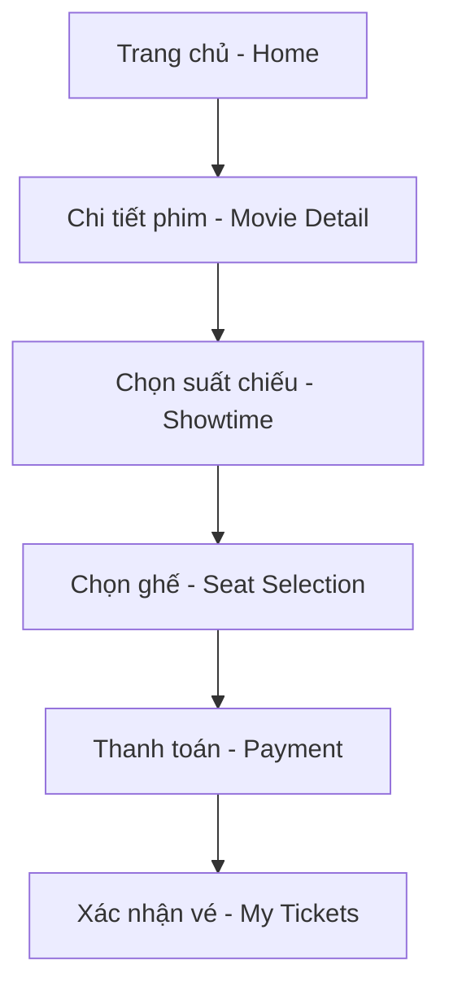

# 🎮 HƯỚNG DẪN XÂY DỰNG FRONTEND – HỆ THỐNG ĐẶT VÉ XEM PHIM ONLINE

> **Đề tài 3 – OOAD**  
> Hệ thống đặt vé xem phim online  
> Công nghệ: ReactJS + CSS Module  
> Giao diện hiện đại – Cảm giác rạp chiếu phim thực tế  

---

## 🎯 1. Mục tiêu

Xây dựng **giao diện web đặt vé xem phim online**, cho phép:
- Xem danh sách phim, trailer, lịch chiếu  
- Chọn suất chiếu, ghế ngồi  
- Thanh toán online (mô phỏng API)  
- Quản lý vé đã đặt  

Frontend cần **hiện đại, trực quan, cảm giác rạp chiếu phim** – tối ưu cho trải nghiệm người dùng.

---

## 🧱 2. Cấu trúc thư mục React + CSS Module

```bash
frontend/
│
├── src/
│   ├── assets/              # Hình ảnh, logo, background, icon
│   ├── components/          # Các component tái sử dụng (Button, Modal, Navbar...)
│   ├── modules/             # Mỗi chức năng chính (Movie, Booking, Payment...)
│   │   ├── Home/
│   │   ├── MovieDetail/
│   │   ├── SeatSelection/
│   │   ├── Payment/
│   │   —— MyTickets/
│   ├── services/            # Gọi API (axios)
│   ├── utils/               # Hàm tiện ích
│   ├── App.js
│   ├── index.js
│   —— styles/              # CSS module toàn cục (theme.module.css)
│
—— package.json
```

---

## 🌈 3. Thiết kế giao diện & phong cách hình ảnh

### 🎞️ **Tông màu chủ đạo:**
| Thành phần | Màu sắc | Ý nghĩa |
|-------------|----------|----------|
| Nền trang | #0C0C0C | Màu tối, gợi cảm giác rạp chiếu phim |
| Vàng neon | #FFD700 | Hiệu ứng ánh sáng màn chiếu |
| Đỏ nhung | #B22222 | Liên tưởng ghế rạp & rèm màn |
| Xám bạc | #C0C0C0 | Tạo độ tương phản tinh tế |

### ✨ **Hiệu ứng:**
- Background: gradient đen → tím → đỏ nhung  
- Button: hiệu ứng glow vàng khi hover  
- Ghế ngồi: đổi màu khi chọn (xanh = trống, đỏ = đã đặt, vàng = đang chọn)  
- Animation: `fadeIn`, `slideUp`, `glowPulse` nhẹ khi load trang  

---

## 🖥️ 4. Cấu trúc trang chính (UI Flow)



---

## 🧩 5. Mô tả từng màn hình

### 🏠 **1. Trang chủ (Home)**
- Hiển thị danh sách phim đang chiếu & sắp chiếu (poster + trailer thumbnail)
- Thanh tìm kiếm phim theo tên
- Thanh navigation: Home | Movie | My Tickets | Login
- Banner chính: hiệu ứng chiếu sáng, đèn rạp  
- Component:  
  - `<Navbar />`  
  - `<MovieCard />`  
  - `<HeroBanner />`

### 🎮 **2. Trang chi tiết phim (Movie Detail)**
- Thông tin phim: tên, mô tả, thời lượng, trailer video  
- Danh sách suất chiếu (theo ngày/giờ)
- Nút "Đặt vé" → chuyển đến `SeatSelection`
- Component:  
  - `<MovieDetailCard />`  
  - `<ShowtimeList />`

### 🛋️ **3. Trang chọn ghế (Seat Selection)**
- Sơ đồ rạp chiếu (ghế được biểu diễn dạng lưới)
- Chọn ghế bằng click → ghế đổi màu (vàng = chọn)
- Hiển thị tổng tiền tạm tính
- Button “Tiếp tục thanh toán”
- Component:  
  - `<SeatGrid />`  
  - `<SeatLegend />`  
  - `<BookingSummary />`

```text
🟩 Ghế trống     🔴 Ghế đã đặt     🟨 Ghế bạn chọn
```

### 💳 **4. Trang thanh toán (Payment)**
- Hiển thị thông tin phim + ghế đã chọn + tổng tiền
- Giả lập thanh toán (chọn phương thức: Momo, VNPay, Visa)
- Button “Xác nhận thanh toán” → thông báo thành công
- Component:  
  - `<PaymentForm />`  
  - `<PaymentSuccessModal />`

### 🎟️ **5. Trang vé của tôi (My Tickets)**
- Danh sách vé đã đặt  
- Hiển thị QR Code (hoặc mã vé)  
- Nút “Hủy vé” (nếu còn thời gian)  
- Component:  
  - `<TicketCard />`  
  - `<QRCode />`

---

## 🔗 6. Kết nối Backend (API mock)

Tạo file `src/services/api.js`:

```js
import axios from "axios";
export const API = axios.create({
  baseURL: "http://localhost:8080/api",
});

// Ví dụ:
export const getMovies = () => API.get("/movies");
export const getShowtimes = (movieId) => API.get(`/movies/${movieId}/showtimes`);
export const bookSeats = (data) => API.post("/booking", data);
```

Trong giai đoạn làm FE, có thể mock bằng file JSON hoặc `json-server`:

```bash
npx json-server --watch data.json --port 8080
```

---

## 🧹 7. Gợi ý giao diện hiện đại

### 💡 Font & Style
- Font chính: `Poppins` / `Roboto`
- Font tiêu đề: `Bebas Neue` (tựa phim)
- CSS Module ví dụ:

```css
/* MovieCard.module.css */
.card {
  background: linear-gradient(145deg, #1a1a1a, #0e0e0e);
  border-radius: 12px;
  box-shadow: 0 0 10px rgba(255, 215, 0, 0.2);
  color: white;
  transition: all 0.3s;
}
.card:hover {
  transform: translateY(-4px);
  box-shadow: 0 0 20px rgba(255, 215, 0, 0.4);
}
```

---

## 🧠 8. Lưu ý khi làm báo cáo OOAD

Trong phần **báo cáo thiết kế (Phần 3)**:
- Mô tả giao diện (UI) gắn với quy trình usecase.  
- Có thể trích các **screenshot** FE thật vào phần “mô hình vận hành mới”.  
- Mỗi màn hình tương ứng với **1 bước trong lược đồ tuần tự**.

---

## 🧾 9. Checklist trước khi nộp

| Mục | Hoàn thành |
|------|-------------|
| Trang chủ (Home) | ✅ |
| Chi tiết phim | ✅ |
| Chọn ghế | ✅ |
| Thanh toán | ✅ |
| Vé của tôi | ✅ |
| CSS module theo theme rạp | ✅ |
| Tích hợp API mock | ✅ |
| Responsive (Mobile / Desktop) | ✅ |

---

> 💡 **Gợi ý thêm:**  
> Có thể thêm nhạc nền nhẹ (cinema ambient), hiệu ứng ánh sáng di chuyển, hoặc animation ghế bật lên khi hover để tạo cảm giác “đang ở trong rạp”.

---

