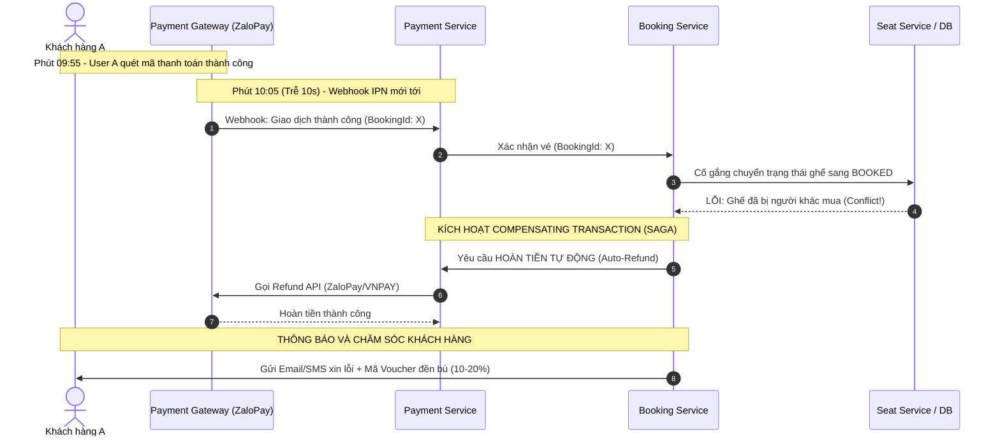

# CẨM NANG TRẢ LỜI PHỎNG VẤN DỰ ÁN XEMPHIM
> **Dự án**: Hệ Thống Đặt Vé Xem Phim & Ma Trận Ghế Tương Tác  
> **Tech stack trích xuất từ CV**: React Frontend, Microservices (6 services), Redis Distributed Lock, RabbitMQ, SQL Server, Jest.

---

## 💡 MẸO GIAO TIẾP KHI TRẢ LỜI (HR vs TECH LEAD)

| Đối tượng phỏng vấn | Trọng tâm cần thể hiện | Cách trả lời khuyên dùng |
| :--- | :--- | :--- |
| **HR / Recruiter** | Nghiệp vụ, giá trị sản phẩm mang lại, kỹ năng giải quyết vấn đề, tinh thần trách nhiệm. | Trả lời ngắn gọn (1–2 phút), nhấn mạnh: *"Dự án giải quyết bài toán chống nghẽn và chống bán trùng vé khi hàng ngàn người săn vé bom tấn cùng lúc, đảm bảo trải nghiệm khách hàng và tính chính xác tài chính."* |
| **Tech Lead / Solution Architect** | Bản chất kỹ thuật (Under the hood), Race Condition, Trade-offs (đánh đổi giải pháp), Fallback & Edge cases. | Trả lời theo mô hình **STAR + Trade-off**: Nêu rõ bài toán -> giải pháp kỹ thuật -> lý do không dùng cách khác -> xử lý khi hệ thống gặp thảm họa (Redis chết, Webhook trễ). |

---

## 🎙️ KỊCH BẢN GIỚI THIỆU DỰ ÁN TÂM ĐẮC NHẤT (PITCH 2 – 2.5 PHÚT)
> **Câu hỏi của Interviewer:** *"Em hãy chọn 1 dự án tâm đắc nhất trong CV để giới thiệu và chia sẻ sâu hơn?"*

### 1. Lời thoại nói mẫu (Word-by-word Pitch):
> *"Dạ, dự án mà em tâm đắc nhất là **Hệ thống Đặt vé Xem phim & Ma trận Ghế Tương tác (XEMPHIM)**.*  
>  
> *Lý do em tâm đắc dự án này không chỉ vì nghiệp vụ quen thuộc, mà vì nó đặt ra một bài toán kỹ thuật rất thách thức trong các hệ thống thương mại: **Xử lý chịu tải cao (High Concurrency) và tính toàn vẹn dữ liệu (Data Consistency) khi hàng ngàn người cùng tranh nhau một số lượng ghế giới hạn trong vài giây mở bán vé bom tấn.**  
>  
> *Để giải quyết bài toán này, em đã thiết kế hệ thống theo mô hình **Microservices gồm 6 dịch vụ độc lập**, kết nối qua API Gateway:*  
>  
> *1. **Về kiến trúc phân tán:** Em tách riêng các service ít thay đổi như `movie-service`, `seat-service` để tối ưu cache, và cô lập phần chịu tải nặng nhất là `booking-service` và `payment-service` để có thể scale độc lập.*  
>  
> *2. **Về bài toán cốt lõi - Chống bán trùng ghế (Double-booking):** Thay vì để hàng ngàn request cùng lúc đập thẳng vào Database gây nghẽn I/O, em áp dụng cơ chế **Phòng thủ 2 tầng (Two-phase)**:*  
>  * - Tầng ngoài dùng **Redis Distributed Lock** với lệnh nguyên tử `SET NX PX` kèm Unique UUID và giải phóng an toàn bằng **Lua Script** để bảo vệ critical section trong vài mili-giây, sau đó tạo một bản ghi giữ chỗ tạm thời (Reservation) trong 10 phút để người dùng thanh toán.  
>  * - Tầng trong là **SQL Server** với khóa bi quan `UPDLOCK, ROWLOCK` kết hợp Unique Index làm chốt chặn cuối cùng nếu hạ tầng Redis gặp sự cố.*  
>  
> *3. **Về xử lý bất đồng bộ & tích hợp thanh toán:** Em sử dụng **RabbitMQ** để xử lý hàng đợi nhả ghế tự động bằng Dead Letter Queue khi hết hạn 10 phút, và gửi vé điện tử QR qua `notification-service`. Khi tích hợp cổng thanh toán (ZaloPay), em áp dụng tư duy **Transactional Outbox Pattern** và **Idempotent Consumer** để giải quyết triệt để lỗi Dual-Write, đảm bảo không bao giờ mất thông tin đơn hàng hay trừ tiền trùng lặp.*  
>  
> *4. **Về phía Frontend:** Em dùng React kết hợp **WebSocket Room-based** để đồng bộ realtime ma trận ghế khi có người chọn/nhả, đồng thời tối ưu re-render cho phòng chiếu 500 - 1000 ghế bằng `React.memo` và chuẩn hóa state.*  
>  
> *Về mặt kiểm thử, em đạt 100% pass Unit Test trên Jest cho các core flow, và dùng **k6** giả lập 500 Virtual Users cùng tranh 1 ghế để xác nhận không một trường hợp nào bị bán trùng vé.*  
>  
> *Anh/chị có muốn em đi sâu vào chi tiết cơ chế khóa Redis Lock, luồng xử lý hoàn tiền tự động khi Webhook bị trễ, hay kiến trúc phân chia 6 services trước ạ?"*

### 2. Chiến thuật tâm lý & Kỹ thuật "Thả mồi câu" (Leading the Interviewer):
* **30 giây đầu tạo ấn tượng mạnh:** Nêu ngay các khái niệm chuẩn Senior: *High Concurrency, Data Consistency, Race Condition*. Định vị bản thân là người giải quyết vấn đề bằng kiến trúc chứ không chỉ là thợ code CRUD.
* **Chiêu kết bài "Thả mồi câu":** Câu kết thúc gợi mở 3 hướng (*Redis Lock*, *Webhook hoàn tiền tự động*, *Kiến trúc 6 services*). Người phỏng vấn sẽ có xu hướng chọn ngay 1 trong 3 chủ đề này — đúng ngay các phần bạn đã chuẩn bị cực kỹ trong tài liệu này!
* **3 điều TUYỆT ĐỐI tránh:**
  * ❌ *Không kể lể CRUD* (đăng ký, đăng nhập, tìm kiếm phim cơ bản...).
  * ❌ *Không khẳng định tuyệt đối* ("Redis 100% không bao giờ lỗi"). Luôn nhắc tới tầng Database Fallback.
  * ❌ *Không nói dài quá 3 phút*, phải giữ tính tương tác (interactive).

---

# PHẦN 0: LÝ DO CHỌN CÔNG NGHỆ & ĐÁNH ĐỔI THỰC TẾ (TECH STACK TRADEOFFS)
> **Mục tiêu:** Trả lời tự tin câu hỏi: *"Tại sao em chọn công nghệ A mà không dùng công nghệ B?"* — thể hiện tư duy Senior biết cân nhắc giữa Lợi ích (Pros) và Đánh đổi (Cons).

---

### 1. Kiến trúc: Microservices vs. Monolith (Nguyên khối)
* **Đối trọng so sánh:** **Monolith** (Tất cả logic đóng gói chung 1 source code và 1 database).
* **Lý do chọn Microservices:**
  * **Scale độc lập theo đặc thù tải (Independent Scaling):** Dịch vụ phim (`movie-service`) chủ yếu là đọc (Read-heavy, cache cao), trong khi `booking-service` chịu tải ghi cực lớn và tranh chấp CPU khi mở bán vé. Tách riêng giúp scale 5–10 instances cho `booking-service` mà không cần lãng phí tài nguyên cho các phần khác.
  * **Cách ly sự cố (Fault Isolation):** Nếu dịch vụ gửi email vé (`notification-service`) bị quá tải hoặc sập, luồng mua vé và thanh toán của khách vẫn hoạt động trơn tru 100%.
* **Đánh đổi chấp nhận (Trade-off):** Hệ thống tăng độ phức tạp trong việc triển khai (DevOps, Docker), độ trễ mạng giữa các service (Network Latency), và phải giải quyết bài toán nhất quán dữ liệu phân tán (Distributed Consistency).

---

### 2. Nền tảng Backend: Node.js (Express) vs. Java (Spring Boot)
* **Đối trọng so sánh:** **Java (Spring Boot)** (Framework Backend doanh nghiệp phổ biến).
* **Lý do chọn Node.js (Express):**
  * **Tối ưu cho bài toán I/O-Intensive & Concurrency cao:** Hệ thống đặt vé chủ yếu chờ I/O (gọi Redis, query SQL Server, publish RabbitMQ, nhận Webhook ZaloPay). Mô hình **Single-Threaded Event Loop** và **Non-blocking I/O** của Node.js xử lý hàng chục ngàn kết nối đồng thời với mức tiêu tốn RAM cực thấp (mỗi service chỉ tốn ~40–60MB RAM lúc chạy).
  * *So với Spring Boot:* Spring Boot theo mô hình truyền thống đa luồng (Thread-per-request). Khi có hàng ngàn request đồng thời, việc tạo hàng ngàn Thread sẽ ngốn lượng RAM rất lớn và tốn chi phí chuyển đổi ngữ cảnh CPU (Context Switching). Ngoài ra, mỗi container Spring Boot ngốn tối thiểu 300MB–500MB RAM, khởi động chậm hơn nhiều so với Node.js khi cần scale container tự động (Auto-scaling) lúc mở bán vé bom tấn.
  * **Đồng nhất ngôn ngữ (Fullstack JavaScript):** Cả Backend và Frontend đều dùng JavaScript/TypeScript, giúp chia sẻ validation logic, kiểu dữ liệu, và tăng tốc độ phát triển cho team.
* **Đánh đổi chấp nhận (Trade-off):** Node.js chạy đơn luồng nên không phù hợp với các tác vụ nặng về tính toán CPU (CPU-Intensive). Nếu có đoạn code thuật toán xử lý nặng, nó có thể làm block Event Loop, đòi hỏi lập trình viên phải tách Worker Thread hoặc đẩy sang queue xử lý riêng.

---

### 3. Xử lý tranh chấp: Redis Distributed Lock vs. Database Lock (`SELECT ... FOR UPDATE` / `UPDLOCK`)
* **Đối trọng so sánh:** **Database Lock** (Khóa dòng trực tiếp trên SQL Server).
* **Lý do chọn Redis Lock:**
  * **Tốc độ In-Memory (<1ms) & Lọc tải rác (Database Shielding):** Nếu 10.000 người cùng bấm tranh 1 chiếc ghế VIP, Redis xử lý trên RAM trong tích tắc: chỉ 1 người lấy được lock, 9.999 người còn lại bị từ chối ngay lập tức. Database SQL Server hoàn toàn không bị ảnh hưởng.
  * *Nếu dùng Database Lock:* 10.000 request dồn xuống DB cùng lúc sẽ làm cạn kiệt Connection Pool, gây nghẽn hàng đợi I/O và dễ dẫn tới Deadlock làm sập cơ sở dữ liệu.
* **Đánh đổi chấp nhận (Trade-off):** Phải quản lý thêm một cụm hạ tầng Redis, phải viết Lua Script để tránh xóa nhầm lock, và chấp nhận rủi ro bất đồng bộ nếu Redis bị crash (cần có DB Unique Constraint làm lớp bọc lót).

---

### 4. Hàng đợi tin nhắn: RabbitMQ vs. Apache Kafka
* **Đối trọng so sánh:** **Apache Kafka** (Hệ thống Distributed Streaming Platform).
* **Lý do chọn RabbitMQ:**
  * **Đúng mục đích sử dụng (Transactional Messaging & Task Queue):** Nghiệp vụ của rạp chiếu phim là gửi tin nhắn tác vụ: gửi email vé QR, bắn thông báo, và hẹn giờ nhả ghế sau 10 phút bằng **Dead Letter Exchange (DLQ)**. RabbitMQ hỗ trợ định tuyến tin nhắn linh hoạt (Routing Key), xác nhận tin cậy (Message ACK) và độ trễ cực thấp (<1ms).
  * *Tại sao không dùng Kafka:* Kafka sinh ra để xử lý luồng dữ liệu Big Data khổng lồ (hàng triệu event/giây để làm log stream, data analytics). Đưa Kafka vào hệ thống đặt vé xem phim là "dùng dao mổ trâu để giết gà", gây phức tạp hóa hạ tầng (ZooKeeper/KRaft) và tốn tài nguyên vận hành không cần thiết.
* **Đánh đổi chấp nhận (Trade-off):** RabbitMQ không lưu trữ lâu dài và không hỗ trợ replay lại toàn bộ dòng lịch sử sự kiện từ vài ngày trước mạnh mẽ như cơ chế Log Retention của Kafka.

---

### 5. Cơ sở dữ liệu: SQL Server (RDBMS) vs. MongoDB (NoSQL)
* **Đối trọng so sánh:** **MongoDB** (Document-based NoSQL Database).
* **Lý do chọn SQL Server:**
  * **Tuân thủ tuyệt đối chuẩn ACID (Data Integrity):** Bài toán tiền bạc, thanh toán và vé xem phim không chấp nhận sai số dù chỉ 1 vé (Zero Tolerance for Double-booking). SQL Server đảm bảo tính nhất quán tức thì (Strong Consistency) và hỗ trợ **Unique Constraint** trên cặp `(ShowtimeId, SeatId)` để chặn đứng việc bán trùng ở tầng vật lý.
  * *Tại sao không dùng MongoDB:* MongoDB thích hợp cho dữ liệu có cấu trúc động và đọc ghi phi cấu trúc. Khi cần thực hiện transaction phức tạp trên nhiều bảng liên kết chặt chẽ (`Users`, `Showtimes`, `Bookings`, `Seats`, `Payments`), NoSQL rất dễ rơi vào trạng thái Eventual Consistency (nhất quán sau cùng), tiềm ẩn nguy cơ xuất vé trùng khi tải cực cao.
* **Đánh đổi chấp nhận (Trade-off):** SQL Server khó mở rộng theo chiều ngang (Horizontal Scale/Sharding) hơn MongoDB, chi phí license và tài nguyên phần cứng cao hơn.

---

### 6. Giao diện Frontend: React SPA vs. Vue.js
* **Đối trọng so sánh:** **Vue.js**.
* **Lý do chọn React:**
  * **Kiểm soát chi tiết hiệu năng Re-render (Fine-grained Render Control):** Ma trận ghế phòng chiếu lớn có từ 500 đến 1.000 ghế. React cung cấp các công cụ tối ưu mạnh mẽ như `React.memo` (với custom comparator) và `useCallback`, giúp cô lập phạm vi render: khi 1 ghế thay đổi trạng thái, chỉ duy nhất ô ghế đó được vẽ lại trên Virtual DOM, toàn bộ 999 ghế còn lại giữ nguyên mà không bị giật lag khung hình.
  * **Hệ sinh thái WebSocket & Thư viện UI:** Hệ sinh thái thư viện kết nối Socket.io và state management của React cực kỳ trưởng thành, dễ chuẩn hóa dữ liệu dạng Normalized Map (`{ [seatId]: data }`).
* **Đánh đổi chấp nhận (Trade-off):** Khác với Vue có reactivity tự động thông minh, React đòi hỏi lập trình viên phải hiểu sâu về cơ chế so sánh tham chiếu (shallow comparison) để tránh gây ra re-render ngoài ý muốn (Unnecessary Re-renders).

---

# PHẦN 1: REDIS DISTRIBUTED LOCK & CƠ CHẾ GIỮ GHẾ

---

### Câu 1: Tại sao set TTL 10 phút? Phân biệt giữa "Lock" và "Reservation" (Giữ chỗ)?
* **Bản chất kỹ thuật:**
  * **Concurrency Lock (Khóa tranh chấp kỹ thuật):** Chỉ nên giữ trong vài chục mili-giây (`TTL = 3000ms`) để bảo vệ **Critical Section** (lúc đọc trạng thái ghế từ DB, kiểm tra điều kiện và ghi trạng thái "Đang giữ" vào DB).
  * **Seat Reservation (Giữ chỗ nghiệp vụ):** Thời gian 10 phút dành cho người dùng nhập thông tin và thanh toán.
* **Cách trả lời chuẩn Senior:**
  > *"Em tách biệt rõ 2 khái niệm này:*  
  > 1. *Tại tầng xử lý lệnh chọn ghế, em dùng **Redis Lock ngắn hạn** (`TTL = 3-5 giây`) kèm cơ chế khóa nguyên tử `SET seat_lock:{showtime_id}:{seat_id} {uuid} NX PX 5000` để ngăn 2 request đồng thời chạm vào DB cùng 1 mili-giây.*  
  > 2. *Sau khi request đầu tiên kiểm tra DB thấy ghế còn trống, hệ thống tạo bản ghi **Reservation tạm thời** với `TTL = 10 phút` (`SET seat_hold:{showtime_id}:{seat_id} {user_id} EX 600`), đồng thời giải phóng ngay Redis Lock ngắn hạn.*  
  > *Như vậy, các request sau chỉ cần kiểm tra key `seat_hold`, nếu tồn tại thì trả về thông báo 'Ghế đang được giữ bởi người khác' ngay lập tức mà không bị block I/O hay treo request."*

---

### Câu 2: Nguy cơ giải phóng nhầm Lock (Release wrong lock) & Giải pháp Lua Script?
* **Tình huống rủi ro:**
  * Tiến trình A lấy lock với TTL 5s. Do mạng lag hoặc GC pause, tiến trình A chạy mất 6s.
  * Hết 5s, Redis tự động giải phóng lock. Tiến trình B lập tức lấy được lock.
  * Đúng lúc này, tiến trình A hoàn tất và chạy lệnh `DEL seat_lock`. Vô tình A đã **xóa mất lock của B**, khiến tiến trình C chen vào -> Xảy ra Race Condition!
* **Giải pháp trả lời:**
  > *"Để tránh xóa nhầm lock của tiến trình khác:*  
  > 1. *Khi acquire lock, em không dùng giá trị tĩnh mà gán một **UUID ngẫu nhiên** kèm request: `SET key uuid NX PX 5000`.*  
  > 2. *Khi release lock, em không dùng lệnh `DEL` trực tiếp, mà bắt buộc dùng **Lua Script** để đảm bảo tính nguyên tử (Atomic Check-and-Delete): chỉ xóa key nếu giá trị lưu trong Redis khớp chính xác với UUID của tiến trình gọi giải phóng."*

```lua
-- Lua Script giải phóng lock an toàn
if redis.call("get", KEYS[1]) == ARGV[1] then
    return redis.call("del", KEYS[1])
else
    return 0
end
```

---

### Câu 3: Lệch pha giữa Đồng hồ đếm ngược Client vs TTL Redis ở giây cuối cùng?
* **Tình huống:** Client đếm ngược còn 1 giây, nhưng do độ trễ mạng (Network Latency), khi request tới Server thì Redis TTL đã quá hạn 10 phút.
* **Cách trả lời:**
  > *"Nguyên tắc cốt lõi: **Backend luôn là Single Source of Truth**, đồng hồ phía Client chỉ mang tính chất hiển thị giao diện (UX).*  
  > *Khi client gửi request thanh toán/xác nhận ở giây cuối cùng, Booking Service sẽ thực hiện kiểm tra nguyên tử: Key `seat_hold:{showtime_id}:{seat_id}` có còn thuộc về `user_id` này hay không?*  
  > *- Nếu key vẫn còn: Cho phép tiến hành tạo giao dịch thanh toán và gia hạn thêm TTL (Renewal/Heartbeat).*  
  > *- Nếu key đã hết hạn hoặc bị người khác giữ: Chặn ngay lập tức tại Backend, trả mã lỗi `409 Conflict: Hết thời gian giữ ghế`, Frontend sẽ nhận mã và chuyển trạng thái ghế về màu xám kèm thông báo để người dùng chọn lại."*

---

### Câu 4: Redis Failover & Tính bền vững của Lock?
* **Tình huống:** Redis Master nhận lệnh giữ ghế, nhưng chưa kịp đồng bộ sang Slave (Asynchronous Replication) thì Master bị crash. Slave lên làm Master mới và chưa có thông tin lock đó.
* **Cách trả lời:**
  > *"Trong môi trường production, có 2 cấp độ xử lý:*  
  > 1. *Đối với hệ thống phân tán khắt khe, có thể dùng thuật toán **Redlock** (ghi lên quá bán $N/2 + 1$ node Redis độc lập).*  
  > 2. *Tuy nhiên Redlock làm tăng độ trễ mạng. Với đặc thù rạp chiếu phim, em áp dụng mô hình **Defense-in-Depth (Phòng thủ nhiều lớp)**: Coi Redis là 'tấm khiên' lọc 99% tải rác ở tầng ngoài. Lớp phòng thủ cuối cùng luôn nằm ở Database SQL Server (Unique Constraint trên cặp `ShowtimeId + SeatId`). Dù Redis failover mất key, tầng DB Transaction vẫn chặn đứng việc ghi đè 2 vé trùng nhau."*

---

# PHẦN 2: KIẾN TRÚC MICROSERVICES & TÍNH NHẤT QUÁN DỮ LIỆU

---

### Câu 1: 6 Microservices cụ thể là gì? Tại sao lại tách thành 6?
* **Cách trả lời:**
  > *"Hệ thống của em chia tách ranh giới nghiệp vụ theo chuẩn Domain-Driven Design (DDD) gồm 6 dịch vụ:*  
  > 1. **User Service (Port 4001):** Quản lý tài khoản, hồ sơ khách hàng, phân quyền.  
  > 2. **Movie Catalog Service (Port 4002):** Danh mục phim, đạo diễn, thể loại, thông tin suất chiếu tĩnh (Read-heavy, cache cao).  
  > 3. **Seat Service (Port 4003):** Sơ đồ ghế, loại ghế (VIP, Thường, Đôi), ma trận phòng chiếu.  
  > 4. **Booking Service (Port 4004):** Core logic xử lý đặt vé, kiểm tra tình trạng giữ ghế, áp mã giảm giá.  
  > 5. **Payment Service (Port 4005):** Tích hợp cổng ZaloPay/VNPAY, quản lý trạng thái thanh toán, Webhook IPN, hoàn tiền (Refund).  
  > 6. **Notification Service (Port 4006):** Gửi Email vé điện tử, mã QR check-in, SMS.  
  >  
  > *Lý do tách 6 service: Tách biệt hoàn toàn phần **Read-heavy** (Movie, Seat Catalog) ít thay đổi để cache tối đa, tách riêng phần **Write-heavy & Concurrency** (Booking) để scale độc lập, và cô lập **Payment** nhằm đảm bảo an toàn bảo mật và tuân thủ PCI-DSS."*

---

### Câu 2: Giao tiếp giữa các service (Sync vs Async)?
* **Cách trả lời:**
  > *- **Giao tiếp Đồng bộ (Sync - REST / gRPC):** Sử dụng khi bắt buộc cần dữ liệu tức thời để phản hồi Client. Ví dụ: Gateway gọi User Service để verify quyền, hoặc Booking Service gọi Seat Service để lấy trạng thái ghế tức thì.*  
  > *- **Giao tiếp Bất đồng bộ (Async - RabbitMQ):** Sử dụng cho các tác vụ không cần chờ kết quả (Fire-and-forget hoặc Event-driven) để giảm độ trễ (latency). Ví dụ: Khi thanh toán thành công, Payment Service bắn event `PaymentSuccessEvent` vào RabbitMQ; Booking Service tiêu thụ để đổi trạng thái vé sang `PAID`, còn Notification Service tiêu thụ để tạo mã QR và gửi email xác nhận vé."*

---

### Câu 3: Xác thực JWT tại API Gateway & Bài toán Thu hồi (Revoke Token)?
* **Cách trả lời:**
  > *- **Xác thực tại Gateway:** Toàn bộ request từ bên ngoài đi qua API Gateway. Gateway đóng vai trò Reverse Proxy & Authentication Filter: kiểm tra tính hợp lệ của JWT (Verify signature, Expiration). Nếu hợp lệ, Gateway extract thông tin `UserId`, `Role` và inject vào Custom Headers (ví dụ `X-User-Id`, `X-User-Role`) rồi mới chuyển tiếp xuống các microservice nội bộ. Các downstream service chỉ cần đọc header này mà không cần parse lại JWT.*  
  > *- **Thu hồi JWT (Revocation / Logout):** Vì JWT là Stateless, để logout hoặc hủy token khi có nghi vấn, em sử dụng kỹ thuật **Redis Token Blacklist**: Khi user logout, lưu `jti` (JWT ID) hoặc chuỗi token vào Redis với TTL bằng đúng thời gian sống còn lại của token. Tại Gateway, mỗi request đến sẽ check nhanh qua Redis memory cache (`EXISTS blacklist:{jti}`); nếu có thì từ chối ngay lập tức."*

---

### Câu 4: Bài toán Dual-Write (Ghi SQL Server và Bắn RabbitMQ)?
* **Tình huống:** Ghi dữ liệu vào SQL Server thành công nhưng network đứt khiến message không gửi được vào RabbitMQ, hoặc ngược lại.
* **Cách trả lời:**
  > *"Để giải quyết vấn đề Dual-Write, giải pháp chuẩn kiến trúc doanh nghiệp là **Transactional Outbox Pattern**:*  
  > 1. *Trong cùng 1 Database Transaction ở SQL Server, em lưu đơn hàng vào bảng `Bookings` đồng thời ghi một bản ghi sự kiện vào bảng `OutboxEvents`.*  
  > 2. *Nếu Transaction commit thành công, chắc chắn cả 2 bản ghi đều được lưu bền vững.*  
  > 3. *Một tiến trình ngầm (hoặc dùng Debezium CDC / Polling Publisher) sẽ đọc từ bảng `OutboxEvents` và publish lên RabbitMQ. Sau khi RabbitMQ xác nhận `ACK`, tiến trình mới đánh dấu sự kiện là `PROCESSED`. Điều này đảm bảo tính chất **At-least-once Delivery** (luôn gửi được tin nhắn, không bao giờ mất)."*

---

# PHẦN 3: RABBITMQ & XỬ LÝ BẤT ĐỒNG BỘ

---

### Câu 1: Cơ chế nhả ghế khi hết hạn 10 phút (Timeout Release)?
* **So sánh & Lựa chọn giải pháp:**
  * *Không nên dùng Redis Keyspace Notification:* Vì Redis Pub/Sub là 'fire-and-forget', không lưu tin nhắn, nếu worker bị crash đúng lúc event phát ra thì mất luôn event nhả ghế.
  * *Giải pháp tối ưu:* Sử dụng **RabbitMQ Dead Letter Exchange (DLQ) / Delayed Message Exchange**.
* **Cách trả lời:**
  > *"Khi người dùng bắt đầu giữ ghế, Booking Service bắn một message vào RabbitMQ với thông tin `{showtimeId, seatId, userId}` và cấu hình `TTL = 600000ms` (10 phút). Message này được cấu hình dead-letter sang một `ReleaseSeatQueue`.*  
  > *Sau đúng 10 phút, message hết hạn sẽ tự động chuyển vào `ReleaseSeatQueue`. Consumer lắng nghe queue này sẽ kiểm tra lại Database: Nếu vé vẫn ở trạng thái `PENDING` (chưa thanh toán), hệ thống sẽ tiến hành mở khóa ghế trên Redis, cập nhật DB về trạng thái `AVAILABLE` và bắn Socket thông báo cho các client khác."*

---

### Câu 2: Idempotency (Chống xử lý lặp lại tin nhắn trong Queue)?
* **Cách trả lời:**
  > *"Để đảm bảo Consumer xử lý tin nhắn trùng lặp (Idempotent Consumer):*  
  > *- Mỗi message sinh ra từ Producer đều được gán một **MessageId duy nhất** (UUID) hoặc dùng chính mã giao dịch `PaymentId` / `BookingId`.*  
  > *- Tại Consumer, trước khi xử lý, em kiểm tra trong SQL Server hoặc Redis xem `MessageId` này đã tồn tại trong bảng `ProcessedMessages` chưa.*  
  > *- Toàn bộ logic cập nhật trạng thái đơn hàng và ghi nhận `MessageId` được bọc trong một Database Transaction duy nhất. Nếu message bị gửi lại lần 2, Consumer check thấy ID đã tồn tại thì lập tức `ACK` bỏ qua mà không thực hiện lại logic trừ tiền hay xuất vé."*

---

# PHẦN 4: FRONTEND REACT & MA TRẬN GHẾ REALTIME

---

### Câu 1: Cơ chế Realtime cập nhật ghế & Khả năng chịu tải?
* **Cách trả lời:**
  > *- Em sử dụng **WebSocket (Socket.io)** để giao tiếp 2 chiều giữa Client và Server.*  
  > *- **Room-based Architecture:** Thay vì broadcast toàn hệ thống, em gom nhóm kết nối theo từng phòng chiếu: `socket.join("showtime_" + showtimeId)`. Chỉ những người đang cùng xem một suất chiếu mới nhận được sự kiện thay đổi trạng thái ghế của nhau.*  
  > *- **Scaling WebSocket:** Khi có hàng ngàn người truy cập, các instance Node.js/Gateway được kết nối thông qua **Redis Pub/Sub Adapter (Socket.io Redis Adapter)** để các socket server đồng bộ message xuyên suốt các node."*

---

### Câu 2: Tối ưu hiệu năng React khi ma trận có 500 – 1000 ghế?
* **Vấn đề:** Khi có 1 ghế thay đổi trạng thái, nếu không tối ưu, toàn bộ 1000 component ghế sẽ bị re-render gây giật lag (frame drop).
* **Cách trả lời:**
  > *"Để tối ưu giao diện ma trận ghế lớn trên React, em áp dụng 3 kỹ thuật:*  
  > 1. **React.memo cho Seat Item:** Bọc từng ô ghế trong `React.memo` với custom comparator: chỉ re-render lại đúng chiếc ghế có `status` thay đổi (`AVAILABLE` -> `HOLDING` -> `BOOKED`).  
  > 2. **State Normalization:** Quản lý state ghế dưới dạng Object/Map theo ID: `{ [seatId]: seatData }` thay vì mảng Array lồng nhau. Việc tra cứu và cập nhật trạng thái đạt độ phức tạp $O(1)$.  
  > 3. **Callback memoization:** Dùng `useCallback` cho các hàm chọn ghế để tránh tạo reference hàm mới làm vô hiệu hóa `React.memo`."*

---

### Câu 3: Phòng chống Client chỉnh sửa đồng hồ máy tính (System Clock Drift)?
* **Cách trả lời:**
  > *- Tuyệt đối không dùng `Date.now()` trên trình duyệt để tính thời gian còn lại.*  
  > *- Khi nhận response giữ ghế thành công từ Server, API trả về `expiresAt` (Unix Timestamp chuẩn UTC của Server) kèm `serverCurrentTime`.*  
  > *- Client tính toán độ lệch: `timeOffset = serverCurrentTime - Date.now()`.*  
  > *- Mọi phép tính đếm ngược đều được quy đổi dựa trên `timeOffset` này. Dù người dùng có cố tình chỉnh giờ máy tính tiến hay lùi, đồng hồ đếm ngược vẫn chạy chính xác theo thời gian thực của Server."*

---

# PHẦN 5: DATABASE LOCKING & UNIT TEST

---

### Câu 1: Database Fallback khi Redis gặp sự cố?
* **Cách trả lời:**
  > *"Nếu Redis gặp sự cố nghiêm trọng, Database SQL Server phải là chốt chặn cuối cùng ngăn chặn overbooking. Em chuẩn bị 2 giải pháp phòng ngự:*  
  > 1. **Pessimistic Concurrency Control (Khóa bi quan):** Sử dụng cú pháp SQL Server có khóa dòng độc quyền:  
  >    `SELECT * FROM Seats WITH (UPDLOCK, ROWLOCK) WHERE ShowtimeId = @sid AND SeatId = @seatId AND Status = 'AVAILABLE'`  
  >    Giao dịch nào đến trước sẽ giữ khóa dòng, giao dịch sau phải chờ cho đến khi giao dịch trước hoàn tất.  
  > 2. **Database Constraint (Ràng buộc toàn vẹn):** Đặt **Unique Index** trên bảng `Tickets` cho cặp `(ShowtimeId, SeatId)`. Bất kỳ hành động cố tình insert trùng vé thứ 2 đều bị SQL Server quăng lỗi vi phạm khóa duy nhất (Primary Key / Unique Violation) ngay lập tức."*

---

### Câu 2: Đánh giá chất lượng Test (Jest Unit Test vs Load Test)?
* **Cách trả lời:**
  > *- **Unit Test (Jest):** Con số 100% pass trên CV thể hiện toàn bộ test suites cho các hàm nghiệp vụ trọng yếu (tính giá vé, logic phân quyền, chuyển đổi trạng thái ghế, xử lý payload webhook) đều pass hoàn toàn.*  
  > *- **Concurrency & Load Test:** Em hiểu rằng Jest chỉ chạy Unit Test/Mocking và không phản ánh được tải thực tế của hệ thống. Vì vậy, em sử dụng thêm **k6** để viết kịch bản giả lập tải: Cho 500 Virtual Users (VUs) cùng gửi request chọn chung 1 ghế trong vòng 1 giây. Kết quả kiểm chứng: Chỉ duy nhất 1 request nhận mã `200 OK`, 499 request còn lại đều nhận `409 Conflict` đúng như thiết kế."*

---

# PHẦN 6: XỬ LÝ TÌNH HUỐNG THỰC TẾ (CRITICAL SITUATION)

---

### Tình huống: Khách hàng trừ tiền thành công, Webhook đến trễ, ghế đã bị người khác mua mất!
* **Bối cảnh:** Khách hàng A giữ ghế A. Tại phút 09:55 khách quét ZaloPay thành công. Do mạng lag, Webhook từ cổng thanh toán gọi về hệ thống ở phút 10:05. Lúc này TTL 10 phút đã hết hạn, ghế A đã bị khách B nhanh tay giữ/mua mất. Tiền của khách A đã bị trừ.

* **Cách xử lý chuẩn mực từ Hệ thống đến Nghiệp vụ:**



* **Câu trả lời trôi chảy khi phỏng vấn:**
  > *"Đây là bài toán kinh điển về **Distributed Concurrency & Third-party Latency**. Để giải quyết bài toán này, hệ thống của em thiết kế theo 3 bước chặt chẽ:*  
  >  
  > 1. **Phát hiện xung đột (Conflict Detection):**  
  >    *Khi Webhook gọi về, Booking Service cố gắng cập nhật vé sang trạng thái `BOOKED`. Khi phát hiện ghế đã bị người khác mua, hệ thống tuyệt đối không được ghi đè, mà ngay lập tức chuyển trạng thái đơn hàng sang `PAYMENT_EXPIRED_SEAT_TAKEN`.*  
  >  
  > 2. **Kích hoạt giao dịch bù trừ tự động (Compensating Transaction / Auto-Refund):**  
  >    *Payment Service tự động gọi ngược lại API Hoàn tiền (Refund API) của ZaloPay/VNPAY để hoàn trả 100% số tiền vào tài khoản/ví của khách hàng A mà không cần khách phải gửi yêu cầu hỗ trợ thủ công.*  
  >  
  > 3. **Trải nghiệm khách hàng (Customer Service & Retention):**  
  >    *Hệ thống gửi ngay một thông báo qua Socket/SMS/Email: 'Rất tiếc, thời gian giữ ghế đã hết hạn trong lúc giao dịch được xử lý. Hệ thống đã tự động hoàn tiền 100% vào tài khoản của bạn, đồng thời tặng bạn 1 Voucher giảm giá 20% cho lần đặt vé tiếp theo'.*  
  >    *Cách xử lý này vừa đảm bảo dữ liệu toàn vẹn, tiền bạc minh bạch, vừa giữ chân được khách hàng."*

---

# 🚀 TỔNG HỢP CÁC TỪ KHÓA VÀNG (CHEAT SHEET NẮM CHẮC TRƯỚC KHI VÀO PHÒNG PV)

1. **Redis Lock:** `SET NX PX`, Unique UUID, Lua Script (Atomic check-and-delete), TTL ngắn hạn cho Lock, TTL dài hạn cho Reservation.
2. **Database:** SQL Server `UPDLOCK, ROWLOCK`, Unique Constraint `(ShowtimeId, SeatId)` làm Fallback cuối cùng.
3. **Message Queue:** RabbitMQ Dead Letter Exchange (DLQ) để nhả ghế tự động sau 10 phút; Message Deduplication & Idempotency Key.
4. **Kiến trúc:** Transactional Outbox Pattern (giải quyết Dual-write), Token Blacklist on Redis, Compensating Transaction (Saga) khi hoàn tiền.
5. **Frontend:** WebSocket Room-based, `React.memo` tối ưu ma trận 1000 ghế, Server-Client Clock offset sync.
